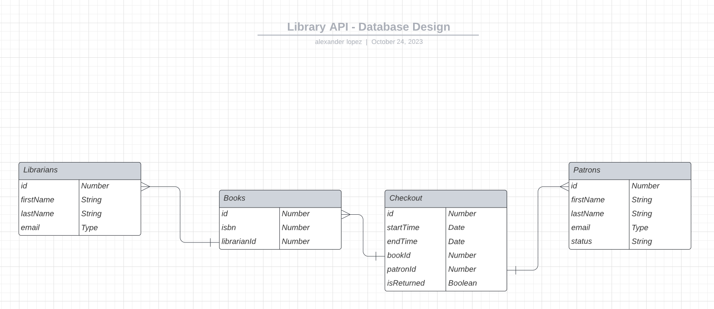
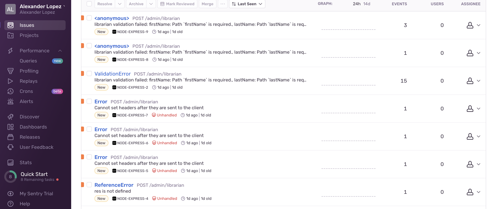

## About

Contains an API, developed with Node.js, Express.js, and Typescript, to simulate common library functions

### Database Design

The following diagram provides an initial overview of the proposed database schema:


## 🏄 Getting Started

```
git clone git@github.com:alexlop29/library-api.git
npm install
npm run start-debug
```

## 🔧 Core libraries

- [Node.js (21.1.0)](https://nodejs.org/en)
- [Typescript](https://www.typescriptlang.org)
- [Mongoose ODM](https://mongoosejs.com)
- [Express.js](https://expressjs.com)
- [Sentry](https://docs.sentry.io/platforms/node/)

### Development Libraries

- [Nodemon](https://nodemon.io)
- [Prettier](https://prettier.io)
- [ESLint](https://eslint.org)
- [Jest.js](https://jestjs.io)
- [mongodb-memory-server](https://nodkz.github.io/mongodb-memory-server/)

## 🌈 Code Quality

Auto format

```
npm run format
```

Error Handling
Application performance monitoring and error tracking is faciliated through Sentry.


## 🚧 To Do

- Implement better error handling
- Remediate ts checks
- Write tests
- Add postman collection
- Create CI/CD tests

Future Improvements:

- Introduce pagination for getAll routes
